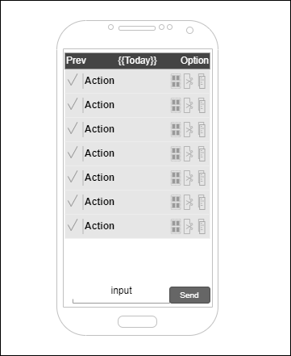

# Tips

一个用于记录每日想法的 APP。

## 设计理念

每当有一个想法的时候，就输入这个想法到今日的想法列表中。

每当新的一天开始的时候，就显示上一天的想法，然后选择带到今天的想法。

这个想法更类似于一个想做的事情，又或者是一个思考，一份感悟。

我希望这个数据可以支持按照日期查看和统计，支持网页端和安卓手机端。

不过我对前端代码完全不熟悉，所以可能只有手机端。

## 功能列表

1. 输入当天的想法
2. 展示当天的想法
3. 新的一天，可以选择昨天的想法复制到今日列表中
4. 查看过去某一天的想法，显示是否带到了下一天的状态
5. 查看过去某一天的想法的数量，区分是新建的还是带过来的
6. 支持服务端存储

## 用户界面

